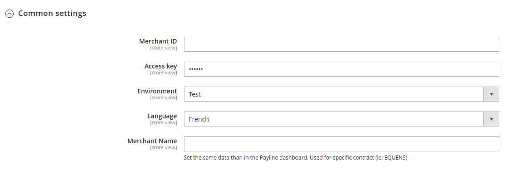

# [](https://www.monext.fr/)

# Monext Magento 2 Module


----

## Table of Content

* [Overview](#overview)
* [Features](#features)
* [Installation](#installation)
    * [Requirements](#requirements)
    * [Installation process](#installation-process)
* [Configuration](#configuration)
* [Additional resources for developers](#additional-resources-for-developers)
* [License](#license)
* [Contact and support](#contact-and-support)

## Overview

This plugin allows you to use the Monext payment system with a Magento 2 ecommerce application.


## Features

This plugin integrate with native Magento 2 orders' workflow and provides the following features:
It allows you to:
* Do onsite payment with embedded widget or offsite on a payment page hosted by Monext.
* Cancel payments.
* Refund payments.

### Supported payment methods

This plugin supports several payment methods.
You can also check [our documentation](https://docs.monext.fr/display/DT/Payment+Method) for more information about other supported payment methods.

## Installation

### Requirements

* Magento 2.4 (current 2.4.7-p3)
* Magento 2.3 (obsolete)


### Installation process

You can install our plugin through Composer

```
composer require monext/magento2-module
bin/magento module:enable Monext_Payline
bin/magento setup:upgrade
```


## Configuration

Here are the main configuration fields for the payment method:

* Open configuration menu under STORES > Settings > Configuration > SALES > Payment Methods > Monext


* Configuration
    * Merchant ID
    * Access key
    * Environment
        * Homologation for debug and test purpose.
        * Production for real payment.
      


* Cpt payment
    * Enable
    * Title
    * Integration type
    * Payment action


* Cpt payment / Payline order status


* Contracts

Contracts are imported under the "Payline Contracts" section.
The multi-select "Contracts" fied allows to choose which one will be visible on your store.


## Additional resources for developers

To learn more about how the API used by the plugin and how to modify or use Magento 2 with it to fit your needs:
* [Magento 2 Plugin Monext documentation](https://docs.monext.fr/display/DT/Magento+2+Plugin)
* [Monext API documentation](https://api-docs.retail.monext.com/reference/getting-started-with-your-api)
* [Magento 2 payments integratrions documentation](https://developer.adobe.com/commerce/php/development/payments-integrations/)

## License

This plugin's source code is completely free and released under the terms of the MIT license.

## Contact and support

If you want to contact us, the best way is through [this page on our website](https://www.monext.fr/gardons-le-contact) and send us your question(s).

We guarantee that we answer as soon as we can!

If you need support you can also directly check our FAQ section and contact us [on the support page](https://support.payline.com/hc/fr).
